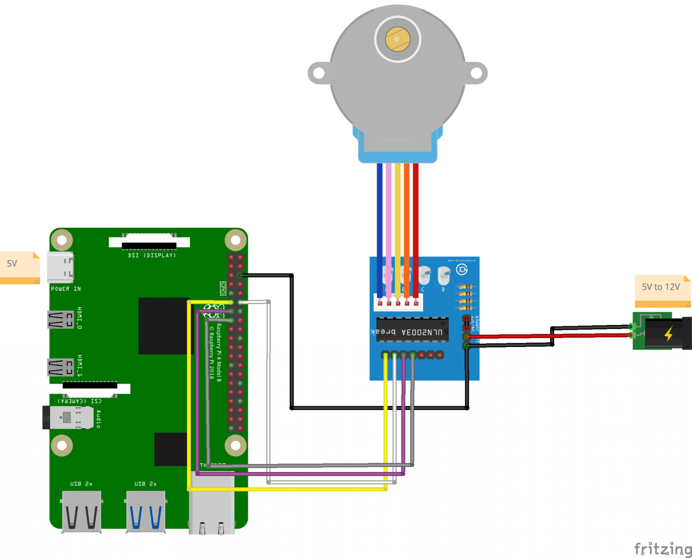

# Automatic Fish Feeder

Raspberry Pi-powered automatic fish feeder that dispenses food on a daily schedule.

# Software

## Setup

1. Clone this repository
2. Set up Python environment:
    ```bash
    # Install required system package
    sudo apt-get update
    sudo apt-get install python3-venv

    # Create and activate virtual environment
    python3.11 -m venv .venv
    source .venv/bin/activate

    # Install dependencies
    pip install -r requirements.txt

    # For easier use, when sshing into the pi,
    # can add this to .bashrc in the pi
    if [ -d "$HOME/fishfeeder" ]; then
        cd "$HOME/fishfeeder"
        if [ -f ".venv/bin/activate" ]; then
            source .venv/bin/activate
        fi
    fi
    ```
3. Configure your settings in `config.py`
4. Run the feeder: `python feeder.py`

### Service Installation
To run as a system service:
```bash
# Copy service file
sudo cp fishfeeder.service /etc/systemd/system/

# Reload systemd
sudo systemctl daemon-reload

# Enable and start service
sudo systemctl enable fishfeeder
sudo systemctl start fishfeeder

# Check status
sudo systemctl status fishfeeder
```

### Testing Service Operation
```bash
# Test service behavior
python feeder.py --test-service

# In another terminal, try:
sudo systemctl status fishfeeder  # Check logs
sudo systemctl stop fishfeeder   # Test clean shutdown
sudo journalctl -u fishfeeder    # View all service logs
```

## Usage

- Normal mode: `python feeder.py`
- Calibration mode: `python feeder.py --calibrate`
- Test hardware: `python feeder.py --test-hardware`
- Test schedule mode: `python feeder.py --test-schedule`
- Test state tracking: `python feeder.py --test-state`
- Test recovery: `python feeder.py --test-recovery`
- Test service: `python feeder.py --test-service`
- Show status: `python feeder.py --status`

### Test Modes
- `--test-hardware`: Quick hardware test - runs 2 feed cycles 5 seconds apart
- `--test-schedule`: Tests scheduling with shorter intervals
- `--test-state`: Tests state file handling with success/failure scenarios
- `--test-recovery`: Tests recovery handling with simulated missed feeds
- `--test-service`: Tests systemd service behavior (signal handling, cleanup)
- `--calibrate`: Performs one full motor revolution for calibration

### Recovery Handling
The feeder can detect and handle missed feeds (e.g., due to power outages):

- Checks for missed feeds on startup
- Configurable recovery window (default: 1 hour)
- Two recovery modes:
  - "feed": Attempt to feed if within recovery window
  - "skip": Log the miss but wait for next scheduled feed

Configure recovery behavior in `config.py`:
```python
RECOVERY_MODE = "skip"  # Options: "feed" or "skip"
MAX_RECOVERY_DELAY = 3600  # Maximum seconds to attempt recovery
RECOVERY_ENABLED = True  # Enable/disable recovery handling
```

### Status Information
The status command shows:
- Last feed time
- Feed status (success/failure)
- Feed counts (total/successful/failed)
- Next scheduled feed
- Active state

## Timezones

Remain super fun ;)   Be sure your PI is set to the desired timezone to ensure the schedule meets your expectations (`sudo raspi-config` and select `Localisation`)

# Hardware Requirements

- Raspberry Pi
- Stepper Motor (28BYJ-48 with ULN2003 driver)
  - Step Angle: 5.625° × 1/64
  - Steps per Revolution: 512 (using half-stepping)
- 3d Print base disk / compartment disk

## 3d Printing Assets

Inspired by https://www.the-diy-life.com/make-an-arduino-based-automatic-fish-feeder/.   Assets for printing are in the assets dir.

## Wiring

Source: https://ben.akrin.com/driving-a-28byj-48-stepper-motor-uln2003-driver-with-a-raspberry-pi/


