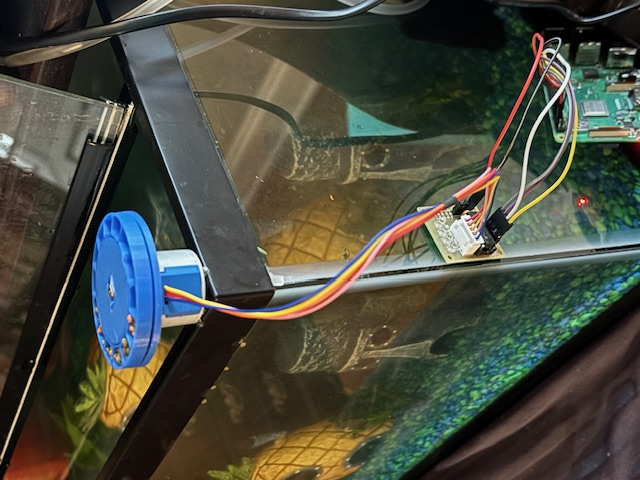

# Automatic Fish Feeder

Raspberry Pi-powered automatic fish feeder that dispenses food on a daily schedule.  Geared to work as a "vacation feeder" with reasonable SLA, but not overly critical.

This could be extended to expose the state file via a web API, but that's not currently implemented (don't want to expose the PI through a home router). In that scenario would be a bit more resilient to failure to "call the neighbors" if something looks _fishy_. :drum:



# Software

## Setup

1. Clone this repository
2. Set up Python environment:
    ```bash
    # Install required system package
    sudo apt-get update
    sudo apt-get install python3-venv

    # Create and activate virtual environment
    python3.11 -m venv .venv
    source .venv/bin/activate

    # Install dependencies
    pip install -r requirements.txt

    # For easier use, when sshing into the pi,
    # can add this to .bashrc in the pi
    if [ -d "$HOME/fishfeeder" ]; then
        cd "$HOME/fishfeeder"
        if [ -f ".venv/bin/activate" ]; then
            source .venv/bin/activate
        fi
    fi
    ```
3. Configure your settings in `config.py`
4. Run the feeder: `python feeder.py`

### Timezones

Remain super fun ;)   Be sure your PI is set to the desired timezone to ensure the schedule meets your expectations (`sudo raspi-config` and select `Localisation`)

### Service Installation
To run as a system service:
```bash
# Copy service file
sudo cp fishfeeder.service /etc/systemd/system/

# Set up log rotation
sudo cp fishfeeder.logrotate /etc/logrotate.d/fishfeeder

# Reload systemd
sudo systemctl daemon-reload

# Enable and start service
sudo systemctl enable fishfeeder
sudo systemctl start fishfeeder

# Check status
sudo systemctl status fishfeeder
```

To stop the service (e.g., after vacation):
```bash
# Stop the service
sudo systemctl stop fishfeeder

# Optionally disable auto-start
sudo systemctl disable fishfeeder

# Verify status (should show inactive)
sudo systemctl status fishfeeder

# Check final state
python feeder.py --status
```

The motor will return to a safe state when stopped, and all pins will be cleaned up.
You can safely leave the service installed for your next vacation.

To clean up state (optional):
```bash
# Backup current state
cp feeder_state.json feeder_state.json.bak

# Reset state file (will be recreated on next start)
rm feeder_state.json

# Or to keep file with clean state:
echo '{"last_feed": null, "active": false, "feed_count": {"total": 0, "successful": 0, "failed": 0}}' > feeder_state.json
```

Note: Cleaning the state file is optional - the service will work fine with existing state,
but resetting it gives you a clean start for your next vacation.

### Recovery Handling
The feeder can detect and handle missed feeds (e.g., due to power outages):

- Checks for missed feeds on startup
- Configurable recovery window (default: 1 hour)
- Two recovery modes:
  - "feed": Attempt to feed if within recovery window
  - "skip": Log the miss but wait for next scheduled feed

### Power Failure Handling
The system is designed to handle power interruptions:

- **Power loss between feeds**
  - Service auto-restarts when power returns
  - Checks for and handles any missed feeds
  - Resumes normal schedule

- **Power loss during feed**
  - Motor returns to safe state on restart
  - Recovery mode handles incomplete feed
  - At worst: one missed feed

All feed attempts are tracked in the state file, ensuring the system
can properly recover after any interruption.

Configure recovery behavior in `config.py`:
```python
RECOVERY_MODE = "skip"  # Options: "feed" or "skip"
MAX_RECOVERY_DELAY = 3600  # Maximum seconds to attempt recovery
RECOVERY_ENABLED = True  # Enable/disable recovery handling
```

### Status Information
The status command shows:
- Last feed time
- Feed status (success/failure)
- Feed counts (total/successful/failed)
- Next scheduled feed
- Active state

## Usage

- Normal mode: `python feeder.py`
- Calibration mode: `python feeder.py --calibrate`
- Test hardware: `python feeder.py --test-hardware`
- Test schedule mode: `python feeder.py --test-schedule`
- Test state tracking: `python feeder.py --test-state`
- Test recovery: `python feeder.py --test-recovery`
- Test service: `python feeder.py --test-service`
- Show status: `python feeder.py --status`

## Test Modes
- `--test-hardware`: Quick hardware test - runs 2 feed cycles 5 seconds apart
- `--test-schedule`: Tests scheduling with shorter intervals
- `--test-state`: Tests state file handling with success/failure scenarios
- `--test-recovery`: Tests recovery handling with simulated missed feeds
- `--test-service`: Tests systemd service behavior (signal handling, cleanup)
- `--test-logs`: Tests log rotation by generating many log entries
- `--calibrate`: Performs one full motor revolution for calibration

### Testing Service Operation
There are two ways to test the service:

1. Test service behavior without installation:
```bash
# This runs a 30-second test of signal handling and cleanup
python feeder.py --test-service
```

2. Test installed service:
```bash
# Start the service
sudo systemctl start fishfeeder

# Monitor the logs
sudo journalctl -fu fishfeeder

# In another terminal, test clean shutdown
sudo systemctl stop fishfeeder
```

The service should:
- Start cleanly and show initialization in logs
- Handle daily feeds according to schedule
- Clean up GPIO pins on shutdown
- Maintain state between restarts


# Hardware Requirements

- Raspberry Pi
- Stepper Motor (28BYJ-48 with ULN2003 driver)
  - Step Angle: 5.625° × 1/64
  - Steps per Revolution: 512 (using half-stepping)
- 3d Print base disk / compartment disk

## 3d Printing Assets

Inspired by https://www.the-diy-life.com/make-an-arduino-based-automatic-fish-feeder/.   Assets for printing are in the assets dir.

## Wiring

Source: https://ben.akrin.com/driving-a-28byj-48-stepper-motor-uln2003-driver-with-a-raspberry-pi/


## Troubleshooting

### Pre-Vacation Checklist
1. Test hardware: `python feeder.py --test-hardware`
2. Verify schedule: `python feeder.py --test-schedule`
3. Check service: `sudo systemctl status fishfeeder`
4. Verify timezone: `date` shows correct time
5. Test recovery: `python feeder.py --test-recovery`

### Common Issues

**Motor not turning**
- Check wiring connections
- Verify GPIO pins in config.py match actual wiring
- Run calibration: `python feeder.py --calibrate`

**Missed Feeds**
- Check logs: `tail -f fishfeeder.log`
- Verify service running: `systemctl status fishfeeder`
- Check state: `python feeder.py --status`
- Review recovery settings in config.py

**Service Won't Start**
- Check permissions on .venv directory
- Verify paths in fishfeeder.service
- Look for errors: `journalctl -u fishfeeder`

### Log Locations
- Application logs: `fishfeeder.log`
- Service logs: `journalctl -u fishfeeder`
- State file: `feeder_state.json`
